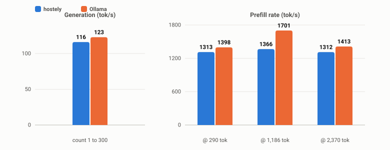

<div align="center">


# hostely

**One Apple-native CLI for your Mac's whole job: run containers, serve LLMs, and know exactly what's left in unified memory.**

[](https://www.apple.com/macos/)
[-333333?style=flat-square)](https://support.apple.com/en-us/HT211814)
[](https://en.cppreference.com/)
[](https://cmake.org/)
[](https://github.com/ggml-org/llama.cpp)
[](https://developer.apple.com/metal/)
[](../../actions/workflows/build.yml)
[](LICENSE)
[](CONTRIBUTING.md)
[](https://github.com/sponsors/AyoubHAMD)
[](https://ko-fi.com/ayohbh)

*Self-host apps and services in OCI containers · Serve GGUF models at full Metal speed · See real headroom before you run out of it*

</div>

---

```sh
$ hostely status
memory
  total     : 32.0 GB
  used%     : 54%
memory model headroom
  available for serve : 11.7 GB   (= free + inactive - 2 GiB safety)
served model
  name   : tinyllama-1.1b-chat-v1.0.Q4_K_M
  quant  : Q4_K - Medium
  params : 1.10 B
  ram    : 980.2 MB peak (estimated)
metal
  device              : Apple M4
  recommended max     : 21.3 GB
```

`hostely` is a self-hosting manager for Apple Silicon. It runs OCI containers
through Apple's own `container` runtime, serves local LLMs through a bundled
llama.cpp with the `ggml-metal` backend, and — the part nothing else does —
reports **system RAM, Metal limits, and the currently-loaded model in the same
units, side by side**, because on an M-series Mac they're all one pool.

```sh
hostely models pull TheBloke/TinyLlama-1.1B-Chat-v1.0-GGUF:Q4_K_M   # 640 MB, resumable
hostely serve TheBloke_TinyLlama-1.1B-Chat-v1.0-GGUF--Q4_K_M        # fit-checked before load
hostely status                                                      # what's loaded + what's left
```

## Why hostely

Every "Docker-for-Mac" pretends the GPU doesn't exist; every "LM server"
pretends the containers don't. On unified memory neither is honest:

- Your LLM's KV cache and your containers compete for the **same physical RAM**.
- `MTLDevice.recommendedMaxWorkingSetSize` is the only public signal for when
  macOS starts evicting Metal allocations — nobody surfaces it next to RSS.
- The number that decides whether a 24B model fits is *available headroom right
  now*, not your machine's spec sheet.

hostely is built around one question: **"what's the biggest thing I can run on
this machine, right now?"** — and it answers it before you OOM, not after.

## Features

| | Capability | How |
|---|---|---|
**Containers** | Run OCI images as managed services | wraps Apple's official `container` CLI (`posix_spawn`, no daemons)
| | Deploy a whole compose-defined stack | `hostely app up <dir>` — reads `compose.yaml`/`docker-compose.yml`, no Docker needed
| | List / stop / logs, repeatable port flags | `hostely ps / stop / logs`
| | Optional per-service memory ceiling | `setrlimit` + Jetsam `memorystatus_control` (root only)
**Models** | `hostely models pull` from Hugging Face | resumable curl downloads, quant selectors (`repo:Q4_K_M`), TOML sidecar manifests
| | Local model registry | `models list / path / rm` with logical names + unique-prefix matching
| | Pre-load **fit advisor** | real tensor + KV-cache sizes vs live free+inactive headroom; refuses configs that won't fit (`--no-fit-check` overrides)
**Inference** | OpenAI-compatible HTTP API | `/v1/models`, `/v1/completions`, `/v1/chat/completions`, `/health`
| | Full Metal offload | upstream `ggml-metal`, zero forks, zero custom kernels
| | **Session KV reuse** | `X-Session-Id` keeps one KV sequence per conversation — turn 2+ prefills only the new tokens (~10× faster than re-reading history)
| | LRU session table | 32 concurrent sessions in one shared `n_ctx` KV pool (`kv_unified`)
**Observability** | `hostely status` | system RAM, CPU, Metal limits, serve headroom, and the loaded model — one screen
| | `hostely top` | live htop-style dashboard: per-container CPU, memory bars, network/disk rates, process counts — next to host RAM and load; `k` stops the selected container (two-press confirm), `--once` for a scriptable snapshot
| | `hostely doctor` | checks container CLI, llama.cpp, Metal, root/entitlement, paths
| | Serve lockfile | `serve.lock.json` with pid liveness + stale-lock detection

### What hostely is *not*

- **Not** a llama.cpp fork. We link `ggml-metal` exactly as upstream ships it —
  ~110 tok/s on TinyLlama-1.1B Q4_K_M on an M4 Pro is the upstream ceiling, and
  that's fine. The novelty is packaging + memory honesty + multi-turn UX, not
  kernel work.
- **Not** an image builder. Pull and run only.
- **Not** cross-platform. Apple Silicon, macOS 15+. That constraint *is* the
  product: every code path assumes unified memory and Metal.
- **Not** a UI. CLI only.

## Requirements

- macOS 15.0+ (15.5+ recommended)
- Apple Silicon (M1–M4)
- Apple clang 17+ (Xcode command-line tools)
- CMake 3.25+
- Apple's [`container` CLI](https://github.com/apple/container/releases) — only
  for `hostely run`; `serve` / `models` / `status` / `doctor` work without it

## Build

**Homebrew** (builds from source; llama.cpp + ggml-metal included):

```sh
brew install AyoubHAMD/tap/hostely
```

**From source:**

```sh
git clone --recurse-submodules https://github.com/AyoubHAMD/hostely.git
cd hostely
cmake -B build -DCMAKE_BUILD_TYPE=Release
cmake --build build -j
./build/hostely --version
```

The first build takes ~5–10 minutes (llama.cpp compiles a lot of GGML code);
incremental builds are fast. Output is a single `./build/hostely` binary —
no separate library to install.

<details>
<summary><strong>Install Apple's <code>container</code> CLI</strong> (only needed for <code>hostely run</code>)</summary>

1. Download `container-installer-signed.pkg` from
   <https://github.com/apple/container/releases>.
2. Run the installer (admin password required).
3. Start the VM subsystem once: `container system start`
4. Verify: `container ls`

`hostely doctor` tells you if any step is missing. The CLI ships with macOS 26
out of the box but is partial on macOS 15 (no container-to-container
networking; Apple won't backport 15-only fixes — the real story is macOS 26's
`container network`).

</details>

## Quickstart

```sh
# 1. Sanity-check your machine.
./build/hostely doctor

# 2. Create state dir + default config.
./build/hostely init

# 3. Pull a model (resumable, writes a TOML sidecar next to the GGUF).
./build/hostely models pull TheBloke/TinyLlama-1.1B-Chat-v1.0-GGUF:Q4_K_M
./build/hostely models list

# 4. Serve it — by logical name or absolute path, both work.
#    hostely fit-checks against live headroom before loading and tells you
#    exactly how many GB you have to spare (or refuses, with numbers).
./build/hostely serve TheBloke_TinyLlama-1.1B-Chat-v1.0-GGUF--Q4_K_M --port 8081

# 5. Chat — send X-Session-Id to keep one KV sequence per conversation.
#    Turn 2+ prefills only the new tokens; history stays cached in-process.
curl http://localhost:8081/v1/models
curl -X POST http://localhost:8081/v1/chat/completions \
     -H 'Content-Type: application/json' -H 'X-Session-Id: chat-1' \
     -d '{"messages":[{"role":"user","content":"My name is Alice."}]}'
curl -X POST http://localhost:8081/v1/chat/completions \
     -H 'Content-Type: application/json' -H 'X-Session-Id: chat-1' \
     -d '{"messages":[{"role":"user","content":"My name is Alice."},
                      {"role":"assistant","content":"Nice to meet you!"},
                      {"role":"user","content":"What is my name?"}]}'
# → "Your name is Alice."   (answered from cached KV, not a re-prefill)

# 6. While it serves, status shows the loaded model + live headroom.
./build/hostely status

# 7. Run services alongside the model (needs Apple's container CLI).
./build/hostely run web --image nginx:alpine --port 8080:80
./build/hostely ps
./build/hostely stop web

# 8. Or deploy an entire compose-defined app in one command.
#    Point it at any directory containing a compose.yaml / docker-compose.yml.
./build/hostely app up ./my-app
./build/hostely app ps
./build/hostely app logs my-app server
./build/hostely app stop my-app
```

### `hostely app` — compose files, no Docker

`hostely app up <dir>` finds a `compose.yaml`/`docker-compose.yml` in `<dir>`
(plus subdirectories, depth 2), translates it for Apple's `container` runtime,
and launches the stack. Re-running `up` reconciles: unchanged services are
left running, changed ones are recreated. What gets translated, and why:

- **Ports** — auto-picked next free port when the compose one is taken
  (printed, and recorded so it's stable across reconciles).
- **Volumes** — named volumes pass through; relative sources become named
  volumes (`<app>-<service>-<dest>`); absolute paths stay bind-mounted with a
  warning (virtiofs on macOS 15 forbids `chown`, so stateful services like
  postgres must use named volumes).
- **Service hostnames** — macOS 15's container runtime has no
  container-to-container DNS, so `PG_DATABASE_HOST=db`-style values are
  rewritten to your Mac's LAN IP (services reach each other via the host's
  published ports).
- **`${VAR:-default}` interpolation** — from `--env K=V` flags, a `.env` next
  to the compose file, then the process environment.
- **DNS** — a `dns:` key per service (`dns: [8.8.8.8, 1.1.1.1]`) sets custom
  nameservers; `hostely run` accepts repeatable `--dns <ip>`. Useful when a
  service must resolve private hostnames, or to pin a known resolver.
- **depends_on** — respected as a start order; healthcheck *conditions* are
  ignored.

Prebuilt images only for now (`build:` is rejected with a clear message —
phase 2 will shell out to `container build`).

## CLI surface

```
hostely init                                create config dir + default config.toml
hostely run <name> [--image img] [--port h:c] [--env K=V] [--dns <ip>] [--mem-gb N]
hostely app up <dir> [--name A] [--env K=V]  deploy a compose-defined stack
hostely app ps | logs <app> [svc] | stop <app> | rm <app>
hostely ps                                  list services
hostely stop <name>
hostely logs <name> [--follow]
hostely serve <name|model.gguf> [--port N] [--ctx-size N] [--gpu-layers N]
                                            [--threads N] [--no-fit-check]
hostely models pull <hf-repo>[:quant] | <url>   download a GGUF + TOML sidecar
hostely models list                              local model registry
hostely models path <name>                      print resolved path (scripting)
hostely models rm <name>                         remove model + sidecar
hostely status                              CPU/RAM/Metal pressure + served model
hostely resources <service>                 per-service rlimits + Jetsam + GPU mem
hostely doctor                              checks: container CLI, llama.cpp, Metal
hostely doctor --exposure                   exposure checks: DNS provider, routes, certs, public IP

# exposure (requires OpenSSL at build time)
hostely certs list | issue <domain> [san...] [--staging] | rm <domain>
hostely proxy serve [--http 80] [--https 443]     TLS/SNI reverse proxy for routes
hostely expose <host> <container> [--port N] [--no-tls] [--off] [--cname t]
hostely expose route list | rm <host>
hostely tunnel <hostname> --relay <host[:port]> [--local-port N]   token via $HOSTELY_TUNNEL_TOKEN
hostely router map <ext> <int> [--udp] | unmap <ext> | status | watch <domain>
```

Every command degrades gracefully if `container` is missing — it prints install
instructions instead of stack-tracing.

### Model registry & sidecar manifests

`hostely models pull` writes a TOML sidecar next to each GGUF:

```toml
source      = "https://huggingface.co/TheBloke/TinyLlama-1.1B-Chat-v1.0-GGUF/resolve/main/..."
repo        = "TheBloke/TinyLlama-1.1B-Chat-v1.0-GGUF"
quant       = "Q4_K_M"
size_bytes  = 668788096
pulled_at   = "2026-08-27T23:00:24Z"
license     = "apache-2.0"
```

Hand-editable (same idiom as `config.toml`), portable (relative paths), and the
basis for `serve <logical-name>` resolution.

### The fit advisor

Before serving, hostely compares **real** numbers — `llama_model_size`,
analytically-computed KV capacity for your `--ctx-size`, and live
free+inactive RAM minus a 2 GiB safety margin:

```
[INFO] fit check : fits with 7.6 GB headroom          → serve
[WARN] fit check : tight: ... within the 1 GiB tolerance
[ERROR] fit check : won't fit: peak RSS exceeds available by 16.7 GB;
                    reduce --ctx-size or pick a smaller quant
[ERROR] refusing to load; pass --no-fit-check to override.
```

### Session-aware serving

`X-Session-Id: <any-string>` gives each conversation its own KV sequence in a
single shared, unified cache. On turn *N*, hostely computes the longest common
token prefix with what's cached, drops only what diverged, and prefills just
the new tokens:

| | prompt tokens | re-prefilled | latency |
|---|---|---|---|
| Turn 1 | 1458 | 1458 | 1.13 s |
| Turn 2 | 1488 | **28** | **0.12 s** |

Sessions are in-process only (lost on restart, by design) and LRU-evicted when
the table fills. Requests without a session id stay fully stateless and
OpenAI-compatible.

## Architecture

```
hostely (single C++ binary)
├── CLI           src/cli/         arg parsing + dispatch
├── Config        src/config/      TOML load/save
├── Service mgr   src/services/    wraps `container` CLI (posix_spawn)
├── Models        src/models/      registry, pull, fit advisor
├── Inference     src/inference/   llama.cpp server, sessions, serve lockfile
├── Resources     src/resources/   CPU/RAM via sysctl+mach, Metal via Obj-C++
└── Logging       src/log/         stderr + rotating logfile

External:
└── llama.cpp/    third_party/llama.cpp/  (git submodule, ggml-metal on)
```

Zero heavyweight dependencies: HTTP is [cpp-httplib], JSON is [nlohmann/json],
TOML is [toml++], downloads shell out to `/usr/bin/curl`, and the only
Objective-C++ translation unit is `src/resources/metal_probe.mm` (Metal has no
C API, so a single `.mm` exports a C ABI for the rest of the codebase).

### Resource model

| Source | API | What we get |
|---|---|---|
| System RAM | `sysctl hw.memsize` + `host_statistics64` | total, free, active, wired, compressed |
| CPU | `sysctl` + `getloadavg` + `task_info` | load avg + per-process RSS / user+sys time |
| Per-service RAM cap | `memorystatus_control(6)` (Jetsam) | hard cap that triggers a jetsam kill |
| Metal recommended max | `MTLDevice.recommendedMaxWorkingSetSize` | ceiling before the OS evicts Metal allocations |
| Metal public-API alloc | `MTLDevice.currentAllocatedSize` | bytes through Metal's *public* allocator |

> **Reading `hostely status` honestly on Apple Silicon:** unified memory means
> `self rss` and the GPU working set are the same physical pool.
> `currentAllocatedSize` intentionally reads small for inference workloads —
> ggml keeps weights in private pools invisible to Metal's public allocator.
> We label the line `current (pub. API)` so you're never misled; trust
> `self rss` for actual residency.

## Benchmarks

Measured with [`scripts/benchmark.py`](scripts/benchmark.py) on a **Mac mini
(2024), Apple M4 (10-core), 32 GB unified memory**, HTTP non-streaming,
greedy decoding (temp 0). Baseline is **Ollama 0.32.5** (`tinyllama:latest`,
Q4_0) — a slight structural advantage, since Q4_0 is faster per token than
the higher-quality Q4_K_M hostely serves. Re-run both on your machine:

```sh
./build/hostely serve <model.gguf> --port 8090 --threads 10
python3 scripts/benchmark.py --name hostely --url http://localhost:8090
python3 scripts/benchmark.py --name ollama --url http://localhost:11434 --model <tag> --no-session
```



| Metric (TinyLlama-1.1B, tok/s) | hostely (Q4_K_M, `--threads 10`) | Ollama 0.32.5 (Q4_0) |
|---|---|---|
| Generation | 116 | 123 |
| Prefill @ 290-token prompt | 1,313 | 1,398 |
| Prefill @ 1,186-token prompt | 1,366 | 1,701 |
| Prefill @ 2,370-token prompt | 1,312 | 1,413 |
| **Multi-turn turn-2 latency** | **216–245 ms vs 1,162–1,172 ms turn 1 (4.8–5.4×)** | — (client can't control slot reuse) |

The honest reading: inference speed is bandwidth-bound and both tools run
upstream llama.cpp, so they're at parity — within ~6% on generation and
±20% at prefill peaks. `scripts/benchmark.py` measures through the
OpenAI-compatible HTTP API of either server, so contributors can reproduce
on M1/M2/M3 and extend the table.

## Verifying the build

```sh
./scripts/smoke.sh                                       # uses the fake container CLI
HOSTELY_MODEL=./models/foo.gguf ./scripts/smoke.sh       # also exercises serve + /v1/models
```

`scripts/smoke.sh` runs init / doctor / status / run / ps / stop / logs
end-to-end against whatever `container` CLI is on PATH (or the bundled
`scripts/fake-container.sh`), in an isolated `$HOME` so it never touches your
real config.

## Roadmap

- [x] Container lifecycle (`run` / `ps` / `stop` / `logs`) via Apple `container`
- [x] Metal-backed OpenAI-compatible inference server
- [x] Honest unified-memory reporting (`status`, `doctor`)
- [x] Hugging Face model pulls with TOML sidecar registry
- [x] Pre-load fit advisor with real tensor + KV sizes
- [x] Session-keyed KV reuse for multi-turn chat
- [x] Native exposure stack — `hostely proxy` / `certs` / `expose` / `tunnel` / `router` with TLS, ACME DNS-01, DNS automation and `doctor --exposure` (see [docs/exposure-roadmap.md](docs/exposure-roadmap.md))
- [ ] `hostely resources` — per-service accounting (needs APIs macOS 15 doesn't expose)
- [ ] Headroom-aware scheduler ("service X wants 20 GB but only 8 GB free")
- [ ] KV-cache quantization + speculative decoding (upstream, when stable)

## Contributing

Issues and PRs are welcome. Keep two constraints in mind:

1. **Apple-only is the product.** Cross-platform abstractions are out of scope.
2. **No llama.cpp forks.** If a fix belongs upstream, it goes upstream.

```sh
cmake --build build -j && ./scripts/smoke.sh
```

A PR that hasn't passed the smoke script will be asked to run it.

## License

[MIT](LICENSE) — except `third_party/llama.cpp`, which is bundled as a git
submodule under its own [MIT license](https://github.com/ggml-org/llama.cpp/blob/master/LICENSE).

## Why not just use Ollama / LM Studio / Docker Desktop?

Fair question. Each is great at its half of the problem:

- **Ollama / LM Studio** serve models at full Metal speed but can't run
  your other services, and neither tells you *before launch* whether the
  model fits in what's left of memory right now — after container
  workloads have taken their share.
- **Docker Desktop & friends** run containers but pretend the GPU doesn't
  exist, so your model server and your services coordinate memory by
  crashing into each other.
- **Both halves compete for the same unified memory**, and no tool reports
  them in the same units, at the same time, from the same process.

hostely is one process that answers the question the others can't:
*"what's the biggest thing I can run on this machine, right now, next to
what's already running?"* If you only ever serve models and nothing else,
Ollama is the mature choice. If you run services *next to* models on an
M-series Mac, that's the gap hostely lives in.

[cpp-httplib]: https://github.com/yhirose/cpp-httplib
[nlohmann/json]: https://github.com/nlohmann/json
[toml++]: https://github.com/marzer/tomlplusplus